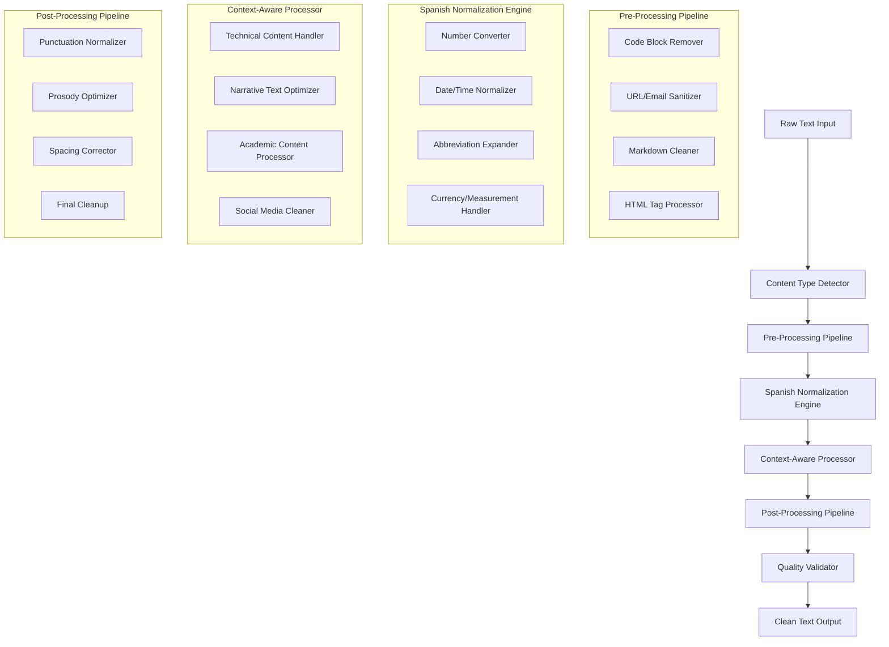

# Design Document

## Overview

This design implements an industrial-grade text cleaning system for Spanish TTS that follows professional linguistic standards. The system uses a multi-stage pipeline approach with specialized processors for different content types, leveraging Effect-TS for robust error handling and composability.

## Architecture

### Core Design Principles

1. **Pipeline Architecture**: Multi-stage processing pipeline where each stage handles specific aspects of text cleaning
2. **Effect-TS Integration**: All operations wrapped in Effect for proper error handling and composability
3. **Context-Aware Processing**: Different strategies based on content type detection
4. **Professional Standards**: Adherence to RAE (Real Academia Española) and professional Spanish TTS guidelines
5. **Immutable Transformations**: Each stage returns a new cleaned version without mutating input

### High-Level Architecture



## Components and Interfaces

### 1. Core Text Cleaning Interface

```typescript
import { Effect } from "effect";

export interface TextCleaningService {
  cleanForTTS: (
    text: string,
    options?: CleaningOptions
  ) => Effect.Effect<string, TextCleaningError>;
  detectContentType: (text: string) => Effect.Effect<ContentType, never>;
  validateCleanedText: (text: string) => Effect.Effect<ValidationResult, never>;
}

export interface CleaningOptions {
  contentType?: ContentType;
  preserveInlineCode?: boolean;
  aggressiveNumberConversion?: boolean;
  expandAllAbbreviations?: boolean;
  optimizeForProsody?: boolean;
}

export type ContentType =
  | "technical"
  | "narrative"
  | "academic"
  | "social"
  | "mixed"
  | "unknown";

export interface ValidationResult {
  isValid: boolean;
  warnings: string[];
  suggestions: string[];
  characterCount: number;
  estimatedDuration: number;
}
```

### 2. Spanish Normalization Engine

```typescript
export interface SpanishNormalizationEngine {
  normalizeNumbers: (text: string) => Effect.Effect<string, NormalizationError>;
  normalizeDates: (text: string) => Effect.Effect<string, NormalizationError>;
  normalizeTime: (text: string) => Effect.Effect<string, NormalizationError>;
  expandAbbreviations: (
    text: string
  ) => Effect.Effect<string, NormalizationError>;
  normalizeCurrency: (
    text: string
  ) => Effect.Effect<string, NormalizationError>;
  normalizeMeasurements: (
    text: string
  ) => Effect.Effect<string, NormalizationError>;
  handleAcronyms: (text: string) => Effect.Effect<string, NormalizationError>;
}
```

### 3. Content Type Processors

```typescript
export interface ContentProcessor {
  canHandle: (contentType: ContentType) => boolean;
  process: (
    text: string,
    options: CleaningOptions
  ) => Effect.Effect<string, ProcessingError>;
}

export interface TechnicalContentProcessor extends ContentProcessor {
  handleInlineCode: (text: string) => Effect.Effect<string, ProcessingError>;
  removeCodeBlocks: (text: string) => Effect.Effect<string, ProcessingError>;
  processVariableNames: (
    text: string
  ) => Effect.Effect<string, ProcessingError>;
}

export interface NarrativeContentProcessor extends ContentProcessor {
  optimizeForStorytelling: (
    text: string
  ) => Effect.Effect<string, ProcessingError>;
  enhanceProsody: (text: string) => Effect.Effect<string, ProcessingError>;
  normalizeDialogue: (text: string) => Effect.Effect<string, ProcessingError>;
}
```

## Data Models

### 1. Text Processing Pipeline State

```typescript
export interface ProcessingState {
  readonly originalText: string;
  readonly currentText: string;
  readonly contentType: ContentType;
  readonly appliedTransformations: TransformationStep[];
  readonly warnings: ProcessingWarning[];
  readonly metadata: ProcessingMetadata;
}

export interface TransformationStep {
  readonly stepName: string;
  readonly processor: string;
  readonly inputLength: number;
  readonly outputLength: number;
  readonly timestamp: Date;
  readonly changes: TextChange[];
}

export interface TextChange {
  readonly position: number;
  readonly originalText: string;
  readonly replacementText: string;
  readonly reason: string;
  readonly confidence: number;
}
```

### 2. Spanish Language Rules

```typescript
export interface SpanishLanguageRules {
  readonly numberRules: NumberConversionRules;
  readonly abbreviationRules: AbbreviationRules;
  readonly punctuationRules: PunctuationRules;
  readonly prosodyRules: ProsodyRules;
}

export interface NumberConversionRules {
  readonly cardinalNumbers: Map<number, string>;
  readonly ordinalNumbers: Map<number, string>;
  readonly fractionRules: FractionRule[];
  readonly decimalRules: DecimalRule[];
  readonly largeNumberRules: LargeNumberRule[];
}

export interface AbbreviationRules {
  readonly commonAbbreviations: Map<string, string>;
  readonly titleAbbreviations: Map<string, string>;
  readonly businessAbbreviations: Map<string, string>;
  readonly technicalAbbreviations: Map<string, string>;
  readonly contextualRules: ContextualAbbreviationRule[];
}
```

## Error Handling

### Error Types and Recovery Strategies

```typescript
export class TextCleaningError extends Error {
  constructor(
    message: string,
    public readonly code: TextCleaningErrorCode,
    public readonly stage: ProcessingStage,
    public readonly originalError?: unknown,
    public readonly recoveryStrategy?: RecoveryStrategy
  ) {
    super(message);
    this.name = "TextCleaningError";
  }
}

export type TextCleaningErrorCode =
  | "INVALID_INPUT"
  | "NORMALIZATION_FAILED"
  | "CONTENT_TYPE_DETECTION_FAILED"
  | "PROCESSING_TIMEOUT"
  | "VALIDATION_FAILED"
  | "UNKNOWN_ERROR";

export type ProcessingStage =
  | "PRE_PROCESSING"
  | "NORMALIZATION"
  | "CONTENT_PROCESSING"
  | "POST_PROCESSING"
  | "VALIDATION";

export interface RecoveryStrategy {
  readonly strategy: "RETRY" | "FALLBACK" | "SKIP_STAGE" | "USE_ORIGINAL";
  readonly maxRetries?: number;
  readonly fallbackProcessor?: string;
  readonly skipToStage?: ProcessingStage;
}
```

## Implementation Strategy

### 1. Pipeline Implementation

The text cleaning pipeline will be implemented as a series of Effect-based transformations:

```typescript
const cleanTextPipeline = (text: string, options: CleaningOptions) =>
  Effect.gen(function* () {
    // Stage 1: Content Type Detection
    const contentType = yield* detectContentType(text);

    // Stage 2: Pre-processing
    const preProcessed = yield* preProcessingPipeline(text, contentType);

    // Stage 3: Spanish Normalization
    const normalized = yield* spanishNormalizationEngine(preProcessed);

    // Stage 4: Context-Aware Processing
    const contextProcessed = yield* contextAwareProcessor(
      normalized,
      contentType,
      options
    );

    // Stage 5: Post-processing
    const postProcessed = yield* postProcessingPipeline(contextProcessed);

    // Stage 6: Validation
    const validation = yield* validateCleanedText(postProcessed);

    if (!validation.isValid) {
      yield* Effect.fail(
        new TextCleaningError(
          "Validation failed",
          "VALIDATION_FAILED",
          "VALIDATION"
        )
      );
    }

    return postProcessed;
  });
```

### 2. Spanish Number Conversion

Professional-grade number conversion following Spanish linguistic rules:

```typescript
const convertNumbersToSpanish = (text: string) =>
  Effect.gen(function* () {
    // Handle different number formats
    const patterns = [
      // Integers: 1,234 -> mil doscientos treinta y cuatro
      /\b\d{1,3}(?:,\d{3})*\b/g,
      // Decimals: 3.14 -> tres coma catorce
      /\b\d+\.\d+\b/g,
      // Ordinals: 1º, 2ª -> primero, segunda
      /\b\d+[ºª]\b/g,
      // Percentages: 25% -> veinticinco por ciento
      /\b\d+(?:\.\d+)?%\b/g,
      // Fractions: 1/2 -> un medio
      /\b\d+\/\d+\b/g,
    ];

    let result = text;

    for (const pattern of patterns) {
      result = result.replace(pattern, (match) => {
        return convertToSpanishNumber(match);
      });
    }

    return result;
  });
```

### 3. Context-Aware Code Handling

Intelligent handling of code content based on context:

````typescript
const handleCodeContent = (text: string, contentType: ContentType) =>
  Effect.gen(function* () {
    // Remove large code blocks completely
    let cleaned = text.replace(/```[\s\S]*?```/g, "");

    // Remove indented code blocks (4+ spaces or tabs)
    cleaned = cleaned.replace(/^[ \t]{4,}.*$/gm, "");

    // Handle inline code based on context
    if (contentType === "technical") {
      // In technical content, preserve inline code for pronunciation
      cleaned = cleaned.replace(/`([^`]+)`/g, (match, code) => {
        return normalizeInlineCode(code);
      });
    } else {
      // In narrative content, remove backticks but keep content
      cleaned = cleaned.replace(/`([^`]+)`/g, "$1");
    }

    return cleaned;
  });
````

### 4. Professional Punctuation Normalization

Following RAE guidelines for proper Spanish punctuation:

```typescript
const normalizePunctuation = (text: string) =>
  Effect.gen(function* () {
    let normalized = text;

    // Spanish quotation marks
    normalized = normalized.replace(/"([^"]+)"/g, "«$1»");

    // Proper spacing around punctuation
    normalized = normalized.replace(/\s*([.,;:!?])\s*/g, "$1 ");

    // Handle inverted question and exclamation marks
    normalized = addInvertedMarks(normalized);

    // Ellipsis normalization
    normalized = normalized.replace(/\.{3,}/g, "…");

    // Em-dash and en-dash handling
    normalized = normalized.replace(/--/g, "—");
    normalized = normalized.replace(/\s*—\s*/g, " — ");

    return normalized.trim();
  });
```

## Testing Strategy

The system will include comprehensive validation through:

1. **Unit Tests**: Each processor component tested individually
2. **Integration Tests**: Full pipeline testing with various content types
3. **Linguistic Validation**: Spanish language expert review of outputs
4. **Performance Tests**: Processing speed and memory usage validation
5. **Edge Case Testing**: Handling of malformed or unusual input

## Performance Considerations

1. **Lazy Evaluation**: Use Effect's lazy evaluation for expensive operations
2. **Caching**: Cache compiled regex patterns and language rules
3. **Streaming**: Process large texts in chunks when possible
4. **Memory Management**: Avoid keeping multiple copies of large texts in memory
5. **Parallel Processing**: Use Effect's parallel capabilities for independent transformations
