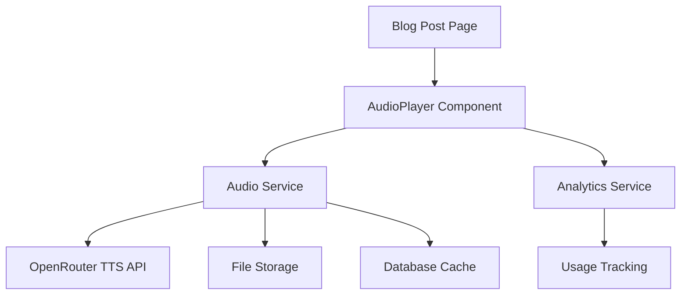

# Design Document

## Overview

The on-demand audio posts feature will provide text-to-speech conversion for blog posts using OpenRouter's API. The system follows a lazy-loading approach where audio is generated only when requested by users, optimizing costs and storage. The solution includes a reusable, minimalist audio player component that integrates seamlessly with the existing blog post UI.

## Architecture

### High-Level Architecture



### System Flow

1. **Initial Load**: Blog post displays with audio player showing "Generate Audio" button
2. **Audio Request**: User clicks button, triggering TTS generation via OpenRouter
3. **Processing**: System converts post text, stores audio file, caches metadata
4. **Playback**: Audio player loads generated file and provides playback controls
5. **Caching**: Subsequent visits serve cached audio immediately

## Components and Interfaces

### 1. AudioPlayer Component

**Location**: `app/components/AudioPlayer.tsx`

```typescript
interface AudioPlayerProps {
  postId: string;
  postTitle: string;
  postBody: string;
  className?: string;
  autoPlay?: boolean;
}

interface AudioPlayerState {
  status: "idle" | "generating" | "ready" | "playing" | "paused" | "error";
  audioUrl?: string;
  currentTime: number;
  duration: number;
  volume: number;
  error?: string;
}
```

**Design Principles**:

- Minimalist UI with clean lines and subtle shadows
- Elegant typography using existing design system fonts
- Smooth animations for state transitions
- Responsive design adapting to container width
- Accessible controls with proper ARIA labels

### 2. Audio Service

**Location**: `app/.server/audio.service.ts`

```typescript
interface AudioService {
  generateAudio(postId: string, text: string): Promise<AudioResult>;
  getAudioUrl(postId: string): Promise<string | null>;
  deleteAudio(postId: string): Promise<void>;
  getAudioStats(postId: string): Promise<AudioStats>;
  uploadToS3(audioBuffer: Buffer, key: string): Promise<string>;
  generatePresignedUrl(key: string): Promise<string>;
}

interface AudioResult {
  audioUrl: string;
  s3Key: string;
  duration: number;
  fileSize: number;
  cost: number;
}
```

### 3. S3 Integration Service

**Location**: `app/.server/s3.service.ts`

```typescript
interface S3Service {
  uploadFile(buffer: Buffer, key: string, contentType: string): Promise<string>;
  generatePresignedUrl(key: string, expiresIn?: number): Promise<string>;
  deleteFile(key: string): Promise<void>;
  fileExists(key: string): Promise<boolean>;
}
```

### 4. Blog Analytics Service

**Location**: `app/.server/analytics.service.ts`

```typescript
interface BlogAnalyticsService {
  trackPageView(postId: string, sessionData: SessionData): Promise<void>;
  trackReadingBehavior(
    postId: string,
    sessionId: string,
    metrics: ReadingMetrics
  ): Promise<void>;
  trackInteraction(
    postId: string,
    sessionId: string,
    interaction: InteractionData
  ): Promise<void>;
  getPostAnalytics(
    postId: string,
    timeRange?: DateRange
  ): Promise<PostAnalytics>;
  getBlogOverview(timeRange?: DateRange): Promise<BlogOverview>;
}

interface ReadingMetrics {
  readingTime: number;
  scrollDepth: number;
  completionRate: number;
}

interface InteractionData {
  event: "click" | "text_select" | "copy";
  elementClicked?: string;
  textSelected?: string;
  coordinates?: { x: number; y: number };
}

interface PostAnalytics {
  views: number;
  avgReadingTime: number;
  avgScrollDepth: number;
  completionRate: number;
  audioGenerations: number;
  audioCompletionRate: number;
  popularSections: string[];
  bouncePoints: number[];
}
```

### 5. Client-Side Analytics Hook

**Location**: `app/hooks/useBlogAnalytics.ts`

```typescript
interface UseBlogAnalyticsReturn {
  trackPageView: () => void;
  trackScroll: (scrollDepth: number) => void;
  trackReadingTime: (seconds: number) => void;
  trackClick: (element: string, coordinates: { x: number; y: number }) => void;
  trackTextSelection: (text: string) => void;
  trackCopy: () => void;
}
```

### 6. Heatmap Data Collection Strategy

**Implementation Approach**:

```typescript
// Coordinate normalization for responsive heatmaps
interface NormalizedCoordinates {
  x: number; // Percentage (0-100) relative to content width
  y: number; // Percentage (0-100) relative to content height
  elementSelector: string; // CSS selector for context
  viewportWidth: number; // For responsive analysis
  viewportHeight: number;
}

// Heatmap data aggregation
interface HeatmapPoint {
  x: number; // Normalized percentage
  y: number; // Normalized percentage
  intensity: number; // Click frequency at this point
  element: string; // Associated DOM element
}
```

**Collection Method**:

1. **Click Tracking**: Capture all clicks within the blog post content area
2. **Coordinate Normalization**: Convert pixel coordinates to percentages relative to content container
3. **Element Context**: Store CSS selector of clicked element for semantic analysis
4. **Viewport Awareness**: Track screen size to handle responsive layouts
5. **Scroll Context**: Include scroll position when click occurred

**Heatmap Generation**:

1. **Data Aggregation**: Group clicks by normalized coordinates (with tolerance radius)
2. **Density Calculation**: Calculate click frequency per area using kernel density estimation
3. **Visualization**: Generate heatmap overlay using HTML5 Canvas or SVG
4. **Responsive Adaptation**: Scale heatmap based on current viewport size

**Privacy Considerations**:

- Only track clicks within blog content area
- No tracking of sensitive UI elements (navigation, personal info)
- Anonymous session IDs only
- Aggregate data after 24 hours, delete individual events

### 3. OpenRouter Integration

**Location**: `app/.server/openrouter.ts`

```typescript
interface OpenRouterTTS {
  generateSpeech(text: string, options: TTSOptions): Promise<AudioBuffer>;
  estimateCost(text: string): number;
  getSupportedVoices(): Voice[];
}

interface TTSOptions {
  voice: string;
  speed: number;
  format: "mp3" | "wav";
}
```

### 4. Database Schema Extension

**Prisma Schema Addition**:

```prisma
model AudioCache {
  id        String   @id @default(auto()) @map("_id") @db.ObjectId
  postId    String   @unique @db.ObjectId
  s3Key     String   // S3 object key
  audioUrl  String   // Pre-signed URL or CloudFront URL
  duration  Int      // in seconds
  fileSize  Int      // in bytes
  cost      Float    // generation cost in USD
  createdAt DateTime @default(now())
  updatedAt DateTime @updatedAt

  post Post @relation(fields: [postId], references: [id])
}

model AudioAnalytics {
  id           String   @id @default(auto()) @map("_id") @db.ObjectId
  postId       String   @db.ObjectId
  event        String   // 'generate', 'play', 'pause', 'complete'
  timestamp    DateTime @default(now())
  sessionId    String?
  userAgent    String?
  playDuration Int?     // for play events
}

model BlogAnalytics {
  id              String   @id @default(auto()) @map("_id") @db.ObjectId
  postId          String   @db.ObjectId
  sessionId       String   // Anonymous session identifier
  event           String   // 'page_view', 'scroll', 'read_time', 'text_select', 'copy', 'click'
  timestamp       DateTime @default(now())

  // Reading behavior
  readingTime     Int?     // seconds spent reading
  scrollDepth     Float?   // percentage of page scrolled (0-100)
  completionRate  Float?   // estimated reading completion (0-100)

  // Interaction data
  elementClicked  String?  // CSS selector or element ID
  textSelected    String?  // selected text (first 100 chars)

  // Heatmap coordinates (normalized percentages)
  clickX          Float?   // X coordinate as percentage (0-100)
  clickY          Float?   // Y coordinate as percentage (0-100)
  scrollY         Float?   // Scroll position when click occurred

  // Viewport context for responsive heatmaps
  viewportWidth   Int?     // Browser viewport width
  viewportHeight  Int?     // Browser viewport height
  contentWidth    Int?     // Content container width
  contentHeight   Int?     // Content container height

  // Technical data
  userAgent       String?
  referrer        String?

  // Privacy-safe metadata
  country         String?  // from IP geolocation
  deviceType      String?  // mobile, tablet, desktop
}

// Aggregated heatmap data for performance
model HeatmapData {
  id              String   @id @default(auto()) @map("_id") @db.ObjectId
  postId          String   @db.ObjectId
  date            DateTime @db.Date // Daily aggregation

  // Heatmap points (JSON array of {x, y, intensity, element})
  clickPoints     Json     // Aggregated click coordinates
  scrollPoints    Json     // Scroll depth distribution

  // Aggregation metadata
  totalClicks     Int
  uniqueSessions  Int
  avgScrollDepth  Float

  createdAt       DateTime @default(now())
  updatedAt       DateTime @updatedAt

  @@unique([postId, date])
}
```

## Data Models

### Audio Player State Management

The component uses React's `useReducer` for state management:

```typescript
type AudioAction =
  | { type: "GENERATE_START" }
  | {
      type: "GENERATE_SUCCESS";
      payload: { audioUrl: string; duration: number };
    }
  | { type: "GENERATE_ERROR"; payload: { error: string } }
  | { type: "PLAY" }
  | { type: "PAUSE" }
  | { type: "SEEK"; payload: { time: number } }
  | { type: "SET_VOLUME"; payload: { volume: number } };
```

### File Storage Strategy

- **Storage Location**: AWS S3 bucket `/audio/posts/{postId}.mp3`
- **CDN Integration**: CloudFront distribution for fast global delivery
- **Access Control**: Pre-signed URLs for secure audio file access
- **Cleanup Policy**: S3 lifecycle policies to archive/delete old files
- **Backup**: S3 versioning and cross-region replication for disaster recovery

## Error Handling

### OpenRouter API Errors

- **Rate Limiting**: Implement exponential backoff with jitter
- **API Failures**: Fallback to alternative TTS service (browser Web Speech API)
- **Network Issues**: Retry mechanism with user feedback
- **Cost Limits**: Daily/monthly spending caps with admin notifications

### Audio Playback Errors

- **File Not Found**: Regenerate audio automatically
- **Playback Failures**: Show error message with retry option
- **Browser Compatibility**: Graceful degradation for unsupported formats

### User Experience

- **Loading States**: Progress indicators with estimated time remaining
- **Error Messages**: Clear, actionable error descriptions in Spanish
- **Retry Mechanisms**: Easy retry buttons for failed operations

## Implementation Notes

### Effect TS Architecture

- All services use Effect for composable error handling
- Type-safe operations with proper error boundaries
- Functional approach for better maintainability

### Performance Considerations

- Lazy loading for audio generation
- S3 pre-signed URLs for secure access
- Daily aggregation for analytics performance

## Advanced Blog Metrics to Capture

### Content Performance Metrics

- **Reading Completion Rate**: Percentage of users who read to the end
- **Scroll Heatmaps**: Where users spend most time reading
- **Bounce Points**: Where users typically leave the post
- **Reading Speed**: Words per minute by user segment
- **Content Sections Performance**: Which H2/H3 sections get most engagement

### User Behavior Insights

- **Audio vs Text Preference**: Correlation between user types and format preference
- **Device-Specific Engagement**: Mobile vs desktop reading patterns
- **Time-of-Day Patterns**: When users prefer audio vs text
- **Content Length Optimization**: Ideal post length for different topics
- **Search Query Mapping**: Which search terms lead to highest engagement

### Content Strategy Metrics

- **Topic Performance**: Which mainTags drive most engagement
- **Content Freshness Impact**: How post age affects engagement
- **Cross-Post Navigation**: User journey between related posts
- **Social Sharing Correlation**: Content elements that drive shares
- **Conversion Funnel**: Blog → Course signup correlation

### Technical Performance

- **Load Time Impact**: How page speed affects reading completion
- **Audio Generation Success Rate**: TTS conversion reliability
- **Error Tracking**: Failed audio generations and user recovery
- **Cost Per Engagement**: ROI of audio feature by post category

## Cost Estimation

Based on your 182 posts analysis:

### OpenRouter TTS Pricing (estimated)

- **Per character**: ~$0.000015 USD
- **Average post**: 5,327 characters = ~$0.08 per audio
- **Total if all generated**: 182 posts × $0.08 = ~$14.56
- **On-demand benefit**: Only pay for requested audio (~20-30% of posts typically)

### Storage Costs

- **Average audio file**: ~2-3 MB per post
- **Total storage**: 182 × 2.5 MB = ~455 MB
- **CDN bandwidth**: Minimal cost for audio delivery

### Analytics Storage

- **Blog analytics**: ~1KB per interaction event
- **Estimated monthly events**: ~50,000 events = 50MB
- **Annual analytics storage**: ~600MB = <$0.02/month

### Development ROI

- **Cost per generated audio**: $0.08
- **User engagement increase**: Estimated 15-25% longer time on page
- **Accessibility improvement**: Better content accessibility compliance
- **Data-driven insights**: Optimize content strategy based on real user behavior
